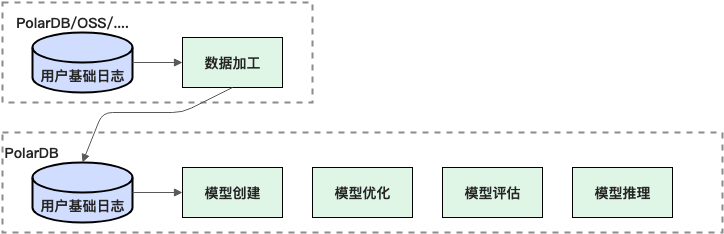

数据加工：将用户原始行为数据加工成算法模型可用的数据。

模型开发及上线：

模型创建：利用PolarDB for AI的模型能力，尤其是BST。结合客户的用户数据，训练一个符合客户场景的高精度的算法模型。

模型微调：根据业务理解，通过调节数据规模、正负样本比例等，利用PolarDB for AI中的模型参数，对模型进行优化。

模型评估：根据业务诉求，对模型的效果进行评估，如果模型效果不好，则进行模型优化，直至达到上线需求。

模型推理：将已经优化好的模型对新的数据进行预测，得到数据结果。

入数据的格式要求
用户行为分析的核心是利用PolarDB for AI的BST算法，对用户数据进行建模，得到结果。原始数据来源不作强制要求。例如：OSS、ADB等均可支持，但需要把数据加工成算法所需的输入格式。

需要构造三类数据：

训练数据：训练数据中根据数据用途分成两个类型，一个是模型直接用来训练的数据（Train），另一个是在训练过程中验证模型好坏，选择最佳参数的验证数据（Validation）。通常会按时间，前半段时间的数据用来训练，后半段时间的数据用来验证。最终数据中需要带上用户标签。

评估数据：和训练数据构造方法类似，但不需要区分用来训练还是验证。最终数据中需要带上用户标签（是否付费/是否流失）。

推理数据：和训练数据构造方法类似，但因为无法知道用户的表现，所以最终数据中的用户标签未知。